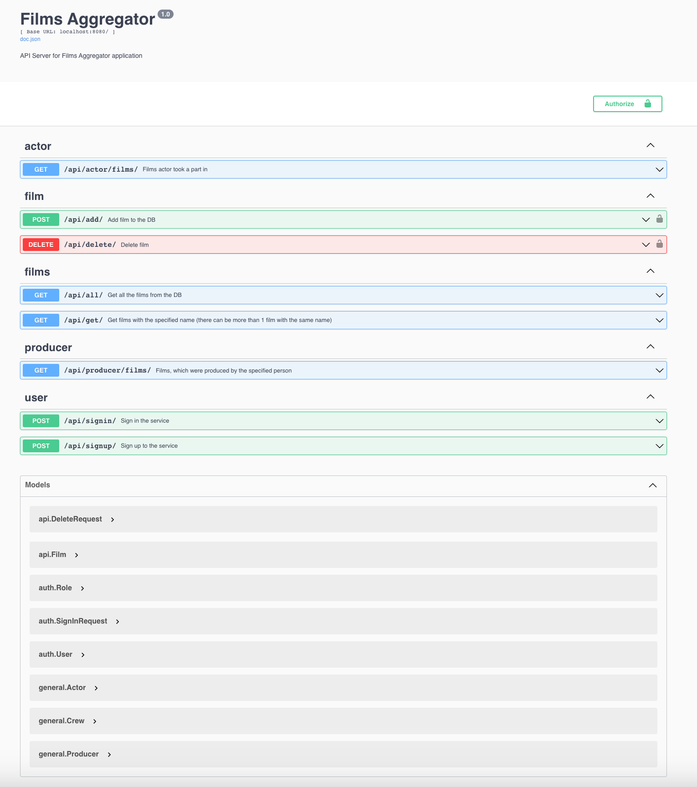
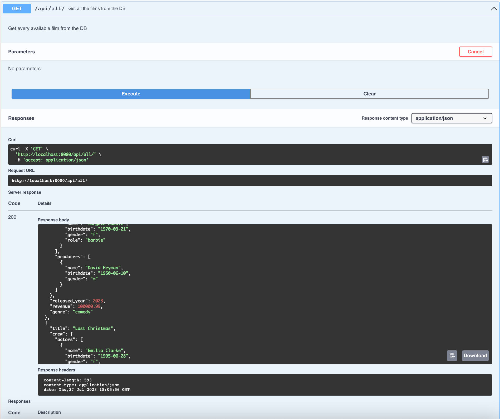
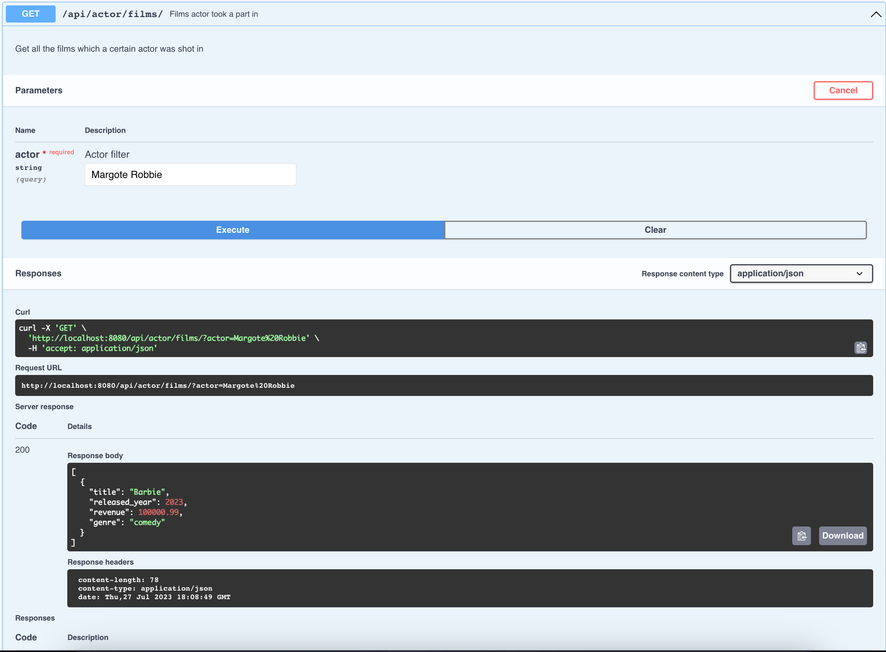
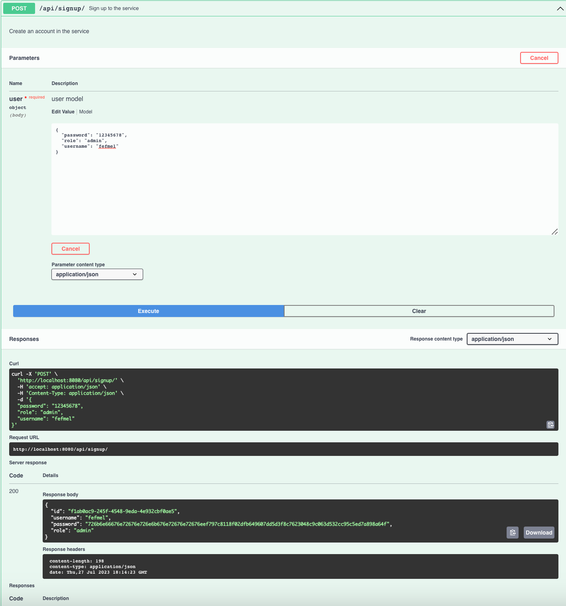
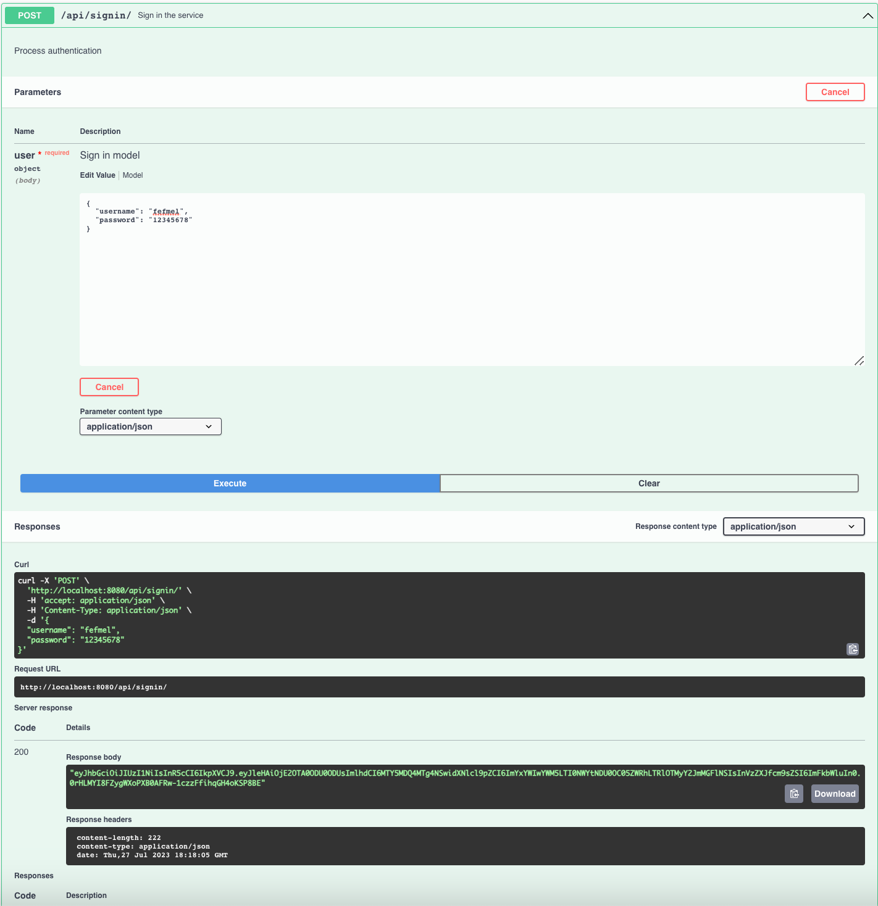
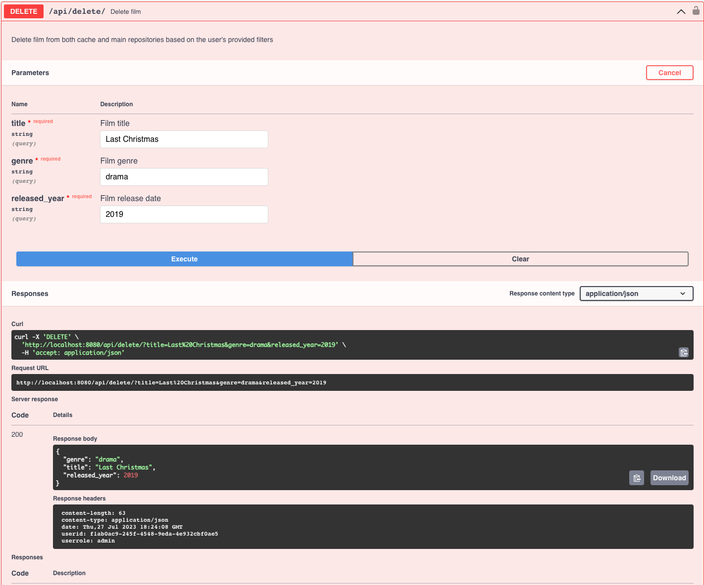
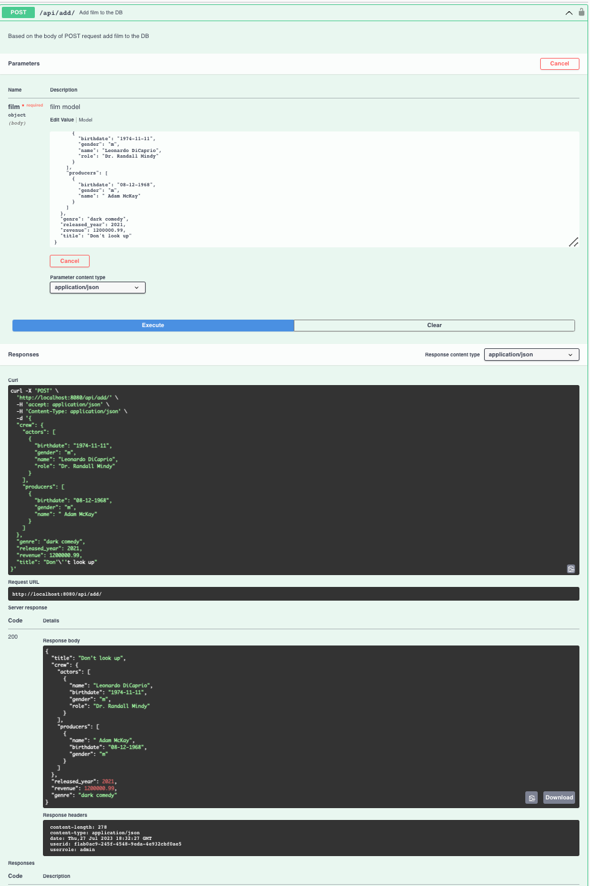

# Films Aggregator Project


## Description

Rest API application. This project is an API which lets users interact with the database filled with information about films. 
Users, depending on their role, may either have full access to the API:(add and delete films) or have restricted access 
but still one that serves their needs: get all the needed information about the show with multiple filters to match their query the best possible way.
There are multiple endpoints available for the interaction with the API.


## Functionality
- ### Basic:
  - Get information about all the available films
  - Get films where actors were shot in
  - Get films that were produced by a precise person
  - Get information about precise film
- ### Admins-only:
  - Add new film to the database
  - Delete film from the database

## Technolologies
- Golang 1.20
- PostgreSQL
- Reindexer
- Docker Compose
- Zap Logger
- Open API
  - Swagger (swaggo)
- Golang-migrate
- JWT 
- Tests: unit testing and integration testing (75% coverage):
  - uber-go.Mock,
  - testify,
  - Dockertest
- YML-based flexible configuration

## Required Environment:
- ### Using docker:
  - Golang 1.20
  - Docker client
- ### Without docker:
  - Golang 1.20
  - PostgresQL
  - Reindexer

## Launch:
To run the app locally you need:
- Clone this repository
- Run any command you wish from the Makefile, for example:
```
make build_dockerize
```

## Interface
- ### Interface of the Swagger UI for this project:

- ### List all the films in the database:

- ### List all the films an actor was shot in:

- ### Sign up form (right now clients can assign their role themselves):

- ### Sign in form

- ### Delete film:

- ### Add film:



## Author
Egor Mikhailov\
telegram: @el_esm\
email: elesmdev1102@gmail.com